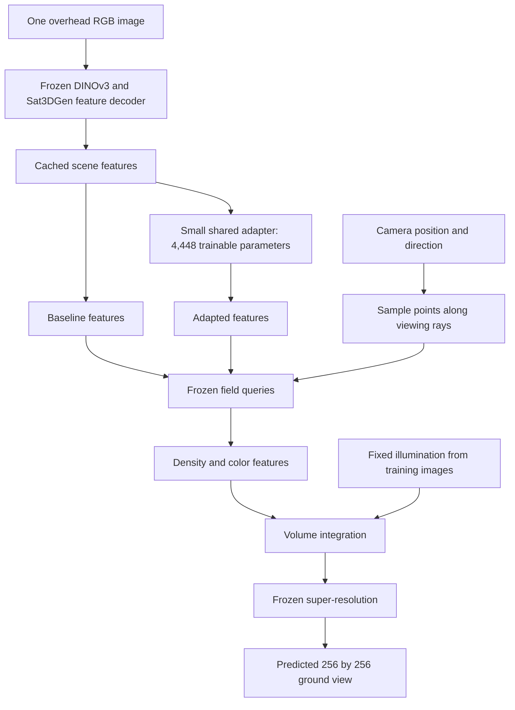

# How this codebase turns an overhead image into a ground view

This guide describes executable code, including the September 15 geometry
control. Proposed building-instance supervision is not yet implemented.

## The model we use

The starting computer-vision model is **Sat3DGen**, using the pinned public
checkpoint. Its overhead encoder is **DINOv3 ViT-L/16 trained for satellite
imagery**, followed by the released scene-feature decoder. This checkpoint
uses a `oneplane` scene representation. Its 64-channel feature tensor is split
into a 32-channel spatial plane and a 32-channel height line. The model queries
these features at 3D points and predicts density plus color features.

Density describes where rays are likely to encounter scene content. Color
features describe the appearance integrated along those rays. A frozen
super-resolution module converts the integrated features into the final image.
The generated facade details are predictions, not recovered observations.

At prediction time, a real ground photograph is not supplied to this model.
During training it supplies the reconstruction target and pseudo building
labels. During evaluation it supplies the comparison image. Those roles are
kept separate in the manifests and run records.

## Where to find each part

| File | Responsibility |
|---|---|
| `src/satground/backend.py` | Load the pinned model, freeze original weights, cache overhead features, and render a camera view |
| `src/satground/adapter.py` | Small residual convolutional adapter; zero initialization reproduces the original model |
| `src/satground/fields.py` | Query baseline/adapted density and appearance separately using shared baseline importance samples |
| `src/satground/camera.py` | Camera matrices and perspective crops of real panoramas |
| `src/satground/losses.py` | RGB/perceptual and image-space building-region/boundary supervision |
| `src/satground/semantics.py` | Frozen SegFormer labels; B0 supplies training supervision and B1 evaluates predictions |
| `src/satground/runs.py` | Training, resume, fixed-camera generation, and resource profiling |
| `src/satground/readiness.py` | Check data provenance and require review before main training |
| `src/satground/annotations.py` | Require explicit, exact-file review of building and validity masks before evaluation |
| `src/satground/metrics.py` | Building metrics, geographic bootstrap, and server decision gates |
| `scripts/diagnose_fields.py` | Four interventions on a completed A1/A3 checkpoint; export RGB and raw geometric maps |
| `scripts/report_geometry_pilot.py` | Verify matched records and rebuild the aggregate geometry-pilot report |
| `scripts/geometry_gallery.py` | First six validation views in fixed order, with explicitly labelled change maps |
| `scripts/prepare_multiview_review.py` | Prepare training-only candidate camera pairs with empty building-identity review records |
| `scripts/prepare_mask_review.py` | Show target-only automatic mask proposals for separate building/validity checks |
| `scripts/patch_mask_proposal.py` | Version explicit pixel corrections without inheriting prior approval |
| `scripts/preview_mask_regions.py` | Enlarge named target regions and highlight exact mask changes without modifying labels or recording approval |
| `src/satground/editor.py` and `editor_ui/` | Local mask painting, resumable drafts, immutable PNG versions, and explicit separation from final acceptance |

## What the new controls mean

**A1** trains the original adapter using RGB and perceptual losses. **A3** adds
building-region and boundary losses measured by a frozen segmenter on the
generated image. A3 can change both density and appearance; an image-segmentation
score alone cannot tell us which changed or whether the geometry became correct.

The diagnostic therefore swaps the fields before rendering. Holding color
features fixed while changing density isolates that pathway. Holding density
fixed while changing appearance must leave opacity and radial maps identical.
Tests enforce that invariance and verify baseline equality and valid gradients.

**GJ** and **GD** are new, separately named training controls. Both retain A3's
image-space losses and use frozen-baseline importance samples. GJ updates the
features used by both density and color queries. GD sends adapted features only
to the density query; its color query reads baseline features. They use equal
training data, capacity, steps, seed, and rendering settings. A GD improvement
would support further investigation, not prove the proposed identity method.

Freezing color does not freeze the RGB image. Moving density changes which
surfaces are visible and their contribution to the final pixels. This is why
independent geometry and reviewed building outlines will matter later.

## What a saved run contains

`run.json` identifies its source code, configuration, data, labels, and fixed
illumination. `training.jsonl` records each optimizer step's losses, gradient
norm, elapsed time, and peak allocated GPU memory. `last.pt` preserves adapter,
optimizer, and random-number states for resume. `summary.json` records completion
and the checkpoint checksum. Generation saves every prediction and its hash;
evaluation saves every preselected view's metrics, not just attractive examples.

The frozen feature cache saves GPU work by avoiding repeated passes through the
large encoder. Memory numbers measured with that cache do not include a cold
encoder pass or all desktop/driver allocations. Cached scene features also do
not contain the paired ground target.

`data/`, `dataset/`, `runs/`, `artifacts/`, and `external/` remain local and ignored
by Git. GitHub receives source, configurations, tests, and aggregate reports.
The original VIGOR photos, precise per-location records, and weights are not
published with the code.

## How progress is judged

Software success means finite gradients, stable memory, a working checkpoint,
and reproducible outputs. Research success requires a consistent improvement
over a matched control on independent locations, reviewed structural evidence,
and preserved image quality. A small GPU requirement establishes feasibility;
it does not establish accuracy or conference novelty.

The next method stage would link supported overhead building regions to reviewed
ground-view instances and supervise a rendered identity/occupancy field. That
requires explicit unknown labels for ambiguous pairs and a generic semantic
rendering baseline. It remains a proposed experiment, described in the
[research assessment](RESEARCH_DIRECTION_ASSESSMENT.md).

A 24-tile, 48-panorama candidate packet is now prepared for that later review.
It has no certified correspondences or masks. Follow the
[identity review guide](IDENTITY_REVIEW_GUIDE.md) to understand its purpose.
The [mask review guide](MASK_REVIEW_GUIDE.md) explains how individual reviewed
outlines can later be used safely in evaluation.
