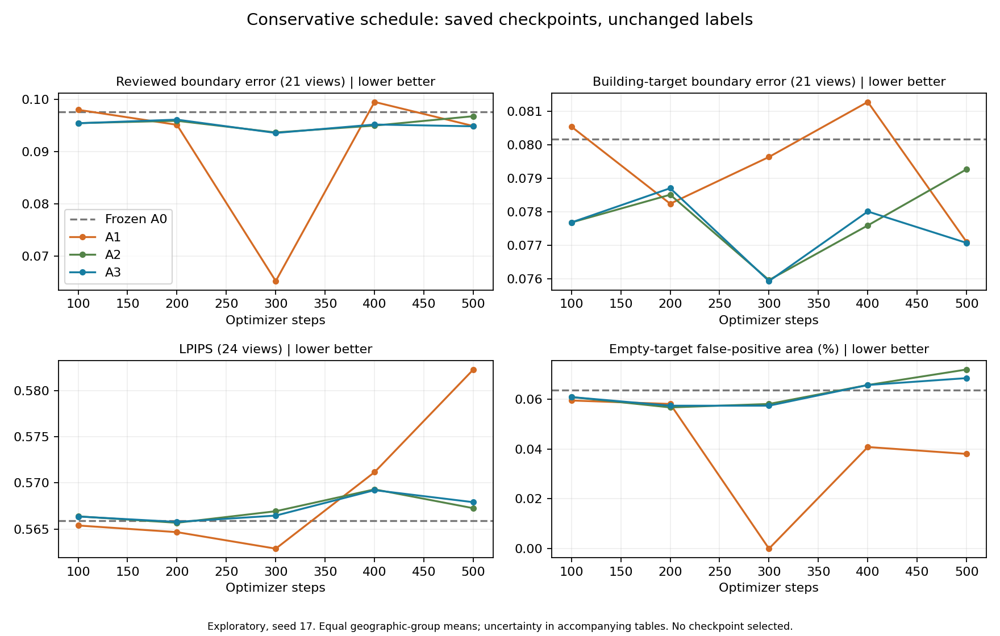

# Longer training is not justified by the current trajectory

**Recommendation: do not start a very long run with the current setup.** The
user made a longer laptop budget available if useful. We checked all saved
conservative checkpoints before making that decision. This is an evaluation
diagnostic with no additional training, not a claim that all longer schedules
must fail.

All 15 checkpoints (A1/A2/A3, steps 100 through 500) and 360 generated images
passed integrity checks. All checkpoint adapter/optimizer tensors and the 1,500
original training-log rows are finite. Regenerating step 500 reproduced all
72 prior A1/A2/A3 images and their expanded-label evaluation rows exactly.
The original final-step choice and all earlier reports remain unchanged.

## Evidence about the late training steps

| Measurement | Step 300 | Step 400 | Step 500 | Interpretation |
|---|---:|---:|---:|---|
| A3 reviewed boundary error | 0.093574 | 0.095194 | 0.094853 | No consistent late decline |
| A3 nonempty-target boundary error | 0.075933 | 0.078013 | 0.077074 | Same mixed trend when empty targets are separated |
| A3 reviewed building IoU | 0.494304 | 0.494478 | 0.500356 | Small region-overlap gain |
| A3 LPIPS | 0.566457 | 0.569213 | 0.567910 | No late perceptual improvement over step 300 |
| A3 empty-target false-positive pixels | 83 | 95 | 99 | False-positive area increases |
| A1 LPIPS | 0.562874 | 0.571165 | 0.582288 | Worsens 3.45% from 300 to 500 |

Lower boundary error, LPIPS and false-positive counts are better. Higher IoU
is better. Means give each geographic group equal weight; false-positive counts
are pooled over the same three empty targets. The 21 reviewed views and 21
nonempty targets are different subsets of the 24-view cohort.

A3 reviewed boundary error is **1.37% worse at 500 than at 300**. The paired
geographic-bootstrap absolute-improvement interval is **[-0.004571, 0.001729]**.
From 400 to 500, the small improvement has interval **[-0.003183, 0.004538]**.
Both include zero. A2's reviewed boundary error worsens 3.32% from 300 to 500,
also with an interval spanning zero. The direction is mixed rather than clear
evidence of continued structural learning.

A3's training loss falls from about 0.533 in steps 301-400 to 0.509 in steps
401-500, while its training region loss falls from 0.512 to 0.469. This shows
continued optimization on the training samples, not improved development
boundaries. The current 100-view training set has already supplied 4,000 image
presentations per model: 500 optimizer steps times eight accumulated examples,
sampled with replacement. That averages 40 presentations per training view,
not 40 exact shuffled epochs.

A1's apparent boundary advantage at step 300 must not be treated as a newly
selected best model. Its three empty-target predictions happen to contain
zero building pixels at that checkpoint, removing a discontinuous empty-mask
penalty. Its nonempty-target boundary score does not show the same sharp dip.
All views and all checkpoints are retained in the report, with empty-target
area reported separately.

The unchanged final A3/A1 comparison remains **0.33% boundary reduction overall
and 0.055% on reviewed views**, with intervals spanning zero. The new trajectory
does not change the original conclusion.

The original three target/model trajectories were also inspected locally for
A1, A2 and A3. A1 becomes increasingly blurred, while A2/A3 retain similar
building errors across checkpoints. These observations are not new human
annotations or verified instance-error counts.

## What to do next

Continue the same single-image structural-supervision question with VIGOR and
Sat3DGen, but resolve the data and measurement uncertainties before extending
the current schedule:

1. Complete satellite-to-ground pairing and camera/coverage checks on development
   examples. The earlier audit matched the upstream camera code but did not
   establish independent real-world heading or building correspondence. Some
   visible buildings may lie outside the supplied overhead crop; that remains
   a diagnostic hypothesis, not an approved exclusion rule.
2. Resolve the recorded building-versus-transport-structure annotation ambiguity
   and independently check a small subset of boundaries. Preserve every accepted
   mask; any approved correction must create a new label version and score all
   compared models equally. User-defined validity exclusions remain intact.
3. Before another training experiment, examine how the boundary objective's
   gradient compares with region and RGB objectives on training images. Scalar
   loss sizes alone cannot establish whether the boundary term changes useful
   scene geometry. Do not tune weights against these reviewed validation masks.
4. If a specific correctable cause is established, specify one matched experiment
   with fixed data, budget and validation checks. Begin with a bounded run and
   extend only if the validation trajectory supports it. More training data must
   come from eligible training groups, not reviewed validation images.

These are the next diagnostic priorities, not experiments already performed or
a promise of improvement. The user-reviewed masks remain evaluation labels;
they must not be silently reused as training supervision. Larger GPUs and
longer schedules do not resolve unknown pairing, missing input coverage, or
ambiguous ground-truth boundaries.

The pretrained base model has already undergone substantial training. Upstream
reports roughly 600,000 iterations on 24 A100 GPUs; our small frozen-backbone
adapter study is a different optimization problem, so that number does not
justify copying its schedule. [Pinned upstream training documentation](https://github.com/qianmingduowan/Sat3DGen/blob/70763aff4d9fc5508e67685c906f84d3cebb34fe/docs/training.md).

## Limits and reproduction

This is one seed, 24 repeatedly inspected development views, 21 human-reviewed
machine proposals and three remaining pseudo-label targets. Pairing, footprint
and duplicate QA remain incomplete. Geographic bootstrap intervals use 2,000
resamples, seed 17, and are unadjusted for the multiple diagnostic comparisons.
No novelty, audited generalization, independent ground-truth certification,
or server-gate pass is established. Seattle, audit and calibration remain sealed.

The diagnostic runner completed all 30 generation/evaluation stages. No training
job was launched, and the completed training monitor stays paused. Image galleries,
identifiers and raw review records remain local; published figures contain only
aggregate metrics.

```powershell
# Fresh output directories are required; the report rechecks saved results on CPU.
& .\.venv\python.exe scripts/report_conservative_trajectory.py --output runs/trajectory-report-recheck --local-output runs/trajectory-gallery-recheck
```

See [all checkpoints](report.md), [paired intervals and provenance](summary.json),
and the [pre-evaluation assessment](../../docs/LONG_TRAINING_ASSESSMENT.md).


